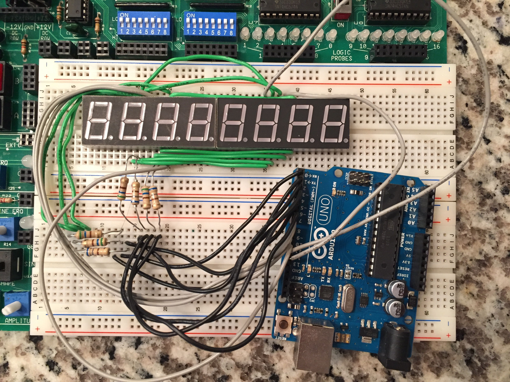

# 8x7seg_display
Code to write letters to an arduino board

# General Information

The Display (DS\#) pins are active LOW, and the Segment Pins (a,b,c,d,e,f,g) are active HIGH.

The characters can be written to the segments using the Arduino PORTD and writing out binary. Keep in mind the most significant bit of PORTD is Digital Pin 6 of the Arduino so it needs to be kept HIGH (disabled) when writing to the displays.

Lighting the digits works by alternating between each digit and lighting it up very quickly with the correct segments selected and then turning it off. When each digit is lit up in succession it gives the effect of them of each digit being lit up constantly.

Here is the flow:

1. Disable all of the Digits
2. Write the correct segment (bits) to Arduino PORTD
3. Enable the Display
4. Delay for 2ms
5. Disable the Display
6. Repeat 1-5 with the next display

## PORTD

The segments are aligned with PORTD as follows.

| Segment| g | f | e | d | c | b | a |
|:------:|:-:|:-:|:-:|:-:|:-:|:-:|:-:|
|        | b6| b5| b4| b3| b2| b1| b0|

*b7 is the digit select for DS4 (1)

# Setup

This project uses 2 4 digit (7 segment) LEDs. The 4 digit displays are model F5461AH.

An Arduino Uno is used to write the letters to the LEDs. 

## Diagram

## Board

## Wiring

### 4 Digit 7 Segment Displays

Position the displays side by side on a breadboard. Align pin 6 of the 1st display on row 20, and pin 6 of the 2nd display on row 40. The displays should be touching and flush.

#### Tie Segment Pins Together

Connect matching a,b,c,d,e,f,g pins between the two displays so that they are electrically connected (getting the same signal).

Don't connect the Digital Select Pins (DS1, DS2, etc...) together because those will need to be indiviually connected to the Arduino.

### Connecting Pins to Arduino

Put a **resistor in series** of each of the segment pins (a,b,c,d,e,f,g) in the path to the Arduino. 
The Digit select pins don't need resistors in series.

Use the following mapping (remember that the segment select pins for each display are connected together and the resistor needs to go in front of the sement select pins):

|F5461AH Pin         | Arduino Pin |
|:------------------:|:-----------:|
| 11/a               | Digital 0   |
|  7/b               | Digital 1   |
|  4/c               | Digital 2   |
|  2/d               | Digital 3   |
|  1/e               | Digital 4   |
| 10/f               | Digital 5   |
|  5/g               | Digital 6   |
|  DS4 (1)           | Digital 7   |
|  DS3 (1)           | Digital 8   | 
|  DS2 (1)           | Digital 9   |
|  DS1 (1)           | Digital 10  |
|  DS4 (2)           | Digital 11  |
|  DS3 (2)           | Digital 12  |     
|  DS2 (2)           | Digital 13  |

*The last digit has been left out because it would have been an anolog pin and would have made writing letters more difficult

## Code

Once everything is wired up, use the [Arduino code](halloween.ino) file, open it in the Arduino IDE, verify it, and upload it to the board.

"Happy Hallos Eve" should be displayed! 
